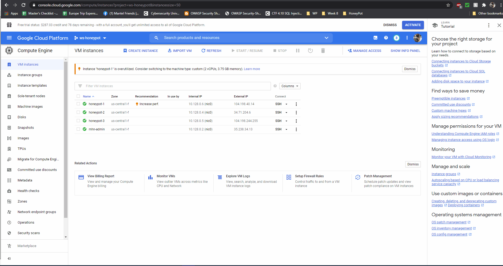

# Honeypot Assignment

**Time spent:** **12** hours spent in total

**Objective:** Create a honeynet using MHN-Admin. Present your findings as if you were requested to give a brief report of the current state of Internet security. Assume that your audience is a current employer who is questioning why the company should allocate anymore resources to the IT security team.

### MHN-Admin Deployment (Required)

**Summary:** How did you deploy it? Did you use GCP, AWS, Azure, Vagrant, VirtualBox, etc.?

*I deployed using the steps provided in assignment. I used GCP as recommended. I ran into issue when deploying it but it resolved when I set the region and zone*

### Dionaea Honeypot Deployment (Required)

**Summary:** Briefly in your own words, what does dionaea do?

*Dionaea logs information for various ports activity on the Honeypot. I noticed that it keeps log of the activity occured or attacks done on it. Ranging from scanning ports and even detecting pcap sessions*
*Addition to that it also accepts payloads from attackers which allow it to capture and copy malwares for study*

### Database Backup (Required) 

**Summary:** What is the RDBMS that MHN-Admin uses? What information does the exported JSON file record?

*I found that MongoDB with db version v3.6.3 is installed. However, MongoDB is not RDBMS. I did found that SQLite3 is installed but couldn't run any commands to find version. The information exported provides details of the atacks happened on the Honeypots/Sensors.*

*Be sure to upload session.json directly to this GitHub repo/branch in order to get full credit.*

### Deploying Additional Honeypot(s) (Optional)

#### Snort Honeypot

**Summary:** What does this honeypot simulate and do for a security researcher?
*Snort performs real time analysis of the traffics, alerting and packet logging. Snort is basically IDS/IPS and it detects and blocks traffic which it founds in its signature*

#### Cowrie Honeypot

**Summary:** What does this honeypot simulate and do for a security researcher?
*Cowrie is medium interaction SSH and Telnet honyepot which basically logs Bruteforce/failed login attemps along with shell interaction. I had tried logging with wrong credentails and it reported to MHN-Admin*

### Malware Capture and Identification (Optional)

#### Wanna-Cry Malware

**Summary:** How did you find it? Which honeypot captured it? What does each malware do?
*Found it by running ClamAV on Dionaea Honeypot. The malware which was caught was Wanna-Cry (A Ransomeware) which encrypts the disks or locks the computer and ask for ransom to unencrypt or provide access back.*
*I found the malware in /opt/dionaea/var/lib/dionaea/binaries*
*There were many malwares, most were Wanna-Cry. Couple of them were Trojen or Malware agents*
MD5 Hash: *92432d0900afe5c691e27cbfdd146c71*

SHA1 Hash: *a867f5313fdfa9e56dfc81270a2d9d2c3a9f96e3*

## Notes

*Ran into issues when deploying mhn-admin but was able to resolve it when chnaged the region and zone to central. Had few issues figuring out the malware but after reading documentation, I was able to resolve it.*

*I was able to find that exploit on Dionaea occuured via port 445 which is for SMB protocol which used to run in older version of Windows. That explains the reason I saw many windows malwares*
